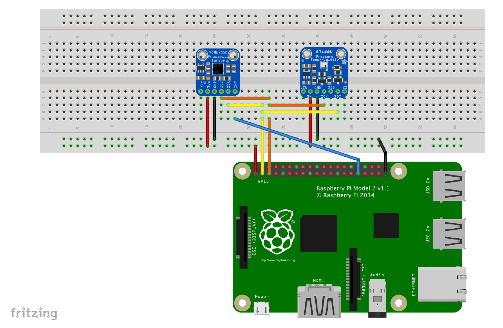

# Smart IoT Device

This repo is a companion application for a [video series from Visual Studio Toolbox](https://www.youtube.com/watch?v=A-kazyOiBvs&list=PLReL099Y5nRdiWdu_J6lVkdYWLjkfZLKk)! [Check out the videos](https://www.youtube.com/watch?v=A-kazyOiBvs&list=PLReL099Y5nRdiWdu_J6lVkdYWLjkfZLKk) for how to get started with Windows IoT Core if you'd like to see this device in action and want more information.

We’ll create a Smart IoT Device application for deployment to your Windows 10 IoT Core device. This application has the following features:

1. Waving in front of the proximity sensor will cause the application to recognize your face and greet you by name in the application UI. This is made possible by [Microsoft Cognitive Services](https://docs.microsoft.com/en-us/azure/cognitive-services/face/overview?WT.mc_id=docs-vstoolbox-suhinton).
2. The temperature of the room will be displayed on screen on the app's UI.
3. The temperature will be reported to [Azure IoT Hub](https://docs.microsoft.com/en-us/azure/iot-hub/about-iot-hub?WT.mc_id=docs-vstoolbox-suhinton) and displayed in [Azure IoT Central](https://azure.microsoft.com/en-us/services/iot-central/).

This is a headed sample. To better understand what headed mode is and how to configure your device to be headed, follow the instructions [here](https://docs.microsoft.com/en-us/windows/iot-core/learn-about-hardware/headlessmode).

Also, be aware that the GPIO APIs are only available on Windows 10 IoT Core, so this sample cannot run on your desktop.

## Connect the components to your Windows IoT device

You’ll need a few components:

*   a [Raspberry Pi 2 or 3](https://www.adafruit.com/product/3055)

*   a [Raspberry Pi Cobbler](https://www.adafruit.com/product/2028)

*   a [BME280 breakout board](https://www.adafruit.com/product/2652) (soldering is required)

*   a [VCNL4010 breakout board](https://www.adafruit.com/product/466) (soldering is required)

*   a [full sized breadboard](https://www.adafruit.com/product/239)

*   some [male to male jumper wires](https://www.adafruit.com/product/758)

*	a [Microsoft Lifecam](https://www.microsoft.com/accessories/en-us/products/webcams/lifecam-hd-3000/t3h-00011)

*   a [5" HDMI screen](https://www.adafruit.com/product/2260) for portability

*   a HDMI cable and USB micro cable for the screen

*	an ethernet cable for connecting the Pi directly to your development computer if desired

### Setting up your breadboard

#### BME280

+ 3V pin to Cobbler's 3V pin
+ GND to Cobbler's GND pin
+ SCK to Cobbler's SCK pin
+ SDI to Cobbler's SDL pin

#### VCNL4010

+ 3V pin to Cobbler's 3V pin
+ GND to Cobbler's GND pin
+ SCK to Cobbler's SCK pin
+ SDI to Cobbler's SDL pin
+ INT to Cobbler's GPIO 16 pin

#### Don't forget to also plug in your Lifecam via USB directly to the Pi!

## Create your Azure Services

1. [Create a Face API subscription key](https://docs.microsoft.com/en-us/azure/cognitive-services/face/quickstarts/csharp?WT.mc_id=docs-vstoolbox-suhinton)
2. [Train the Face API to recognize your face](https://docs.microsoft.com/en-us/azure/cognitive-services/face/face-api-how-to-topics/howtoidentifyfacesinimage?WT.mc_id=docs-vstoolbox-suhinton)
3. [Create an Azure IoT Central application](https://docs.microsoft.com/en-us/azure/iot-central/quick-deploy-iot-central?WT.mc_id=docs-vstoolbox-suhinton) (or Azure IoT Hub directly if you'd prefer not to use IoT Central)
4. Create a device via either [Azure IoT Central](https://docs.microsoft.com/en-us/azure/iot-central/tutorial-add-device?WT.mc_id=docs-vstoolbox-suhinton), or Azure IoT Hub. Note down the device id and the connection string for that device.

The credentials needed are listed as empty string variables in [Constants/CredentialsConstants.cs](https://github.com/noopkat/iotcore-smart-device/blob/master/Constants/CredentialsConstants.cs). Fill these in with your own created via the steps above.

## Deploy your app

1.  With the application open in Visual Studio, set the architecture in the toolbar dropdown. As you’re building for Raspberry Pi 2 or 3, select `ARM`.

2.  Next, in the Visual Studio toolbar, click on the `Local Machine` dropdown and select `Remote Machine`

    

3.  At this point, Visual Studio will present the **Remote Connections** dialog. If you previously used [PowerShell](https://docs.microsoft.com/en-us/windows/iot-core/connect-your-device/powershell) to set a unique name for your device, you can enter it here (in this example, we’re using **my-device**). Otherwise, use the IP address of your Windows IoT Core device. After entering the device name/IP select `Universal` for Windows Authentication, then click **Select**.

    

4.  You can verify or modify these values by navigating to the project properties (select **Properties** in the Solution Explorer) and choosing the `Debug` tab on the left:

    

When everything is set up, you should be able to press F5 from Visual Studio. If there are any missing packages that you did not install during setup, Visual Studio may prompt you to acquire those now. The SmartHomeDevice app will deploy and start on the Windows IoT device.

Congratulations! You controlled some advanced devices on your Windows IoT device.

## Additional resources
* [Windows 10 IoT Core home page](https://developer.microsoft.com/en-us/windows/iot/)
* [Documentation for official Microsoft Iot Core samples](https://developer.microsoft.com/en-us/windows/iot/samples)

This project has adopted the Microsoft Open Source Code of Conduct. For more information see the Code of Conduct FAQ or contact <opencode@microsoft.com> with any additional questions or comments.
